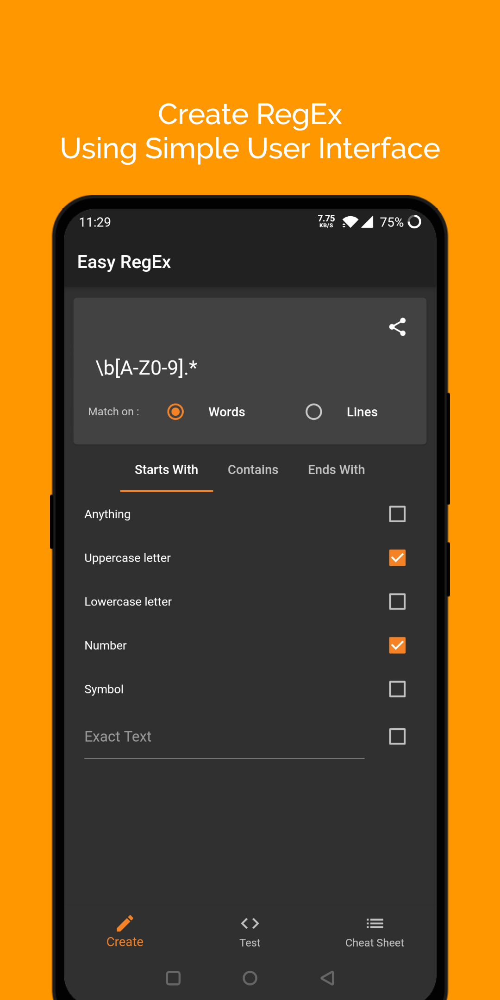
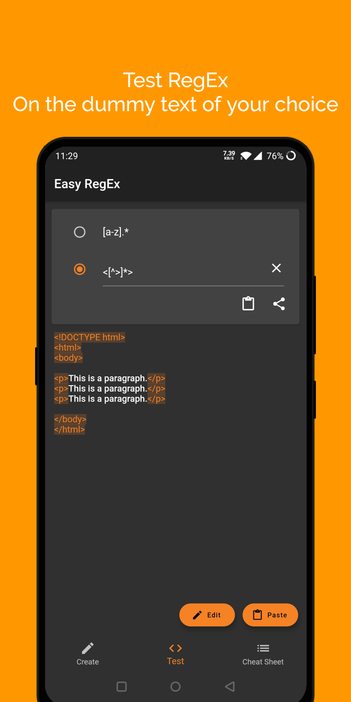
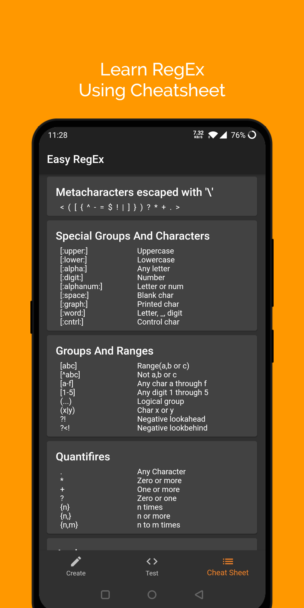

# Easy Regex
1. This project was created with intentions of learning Flutter.
2. This project is a tool that can help beginners to Create, Test and Learn Regular Expressions.
3. Creating RegEx is done by asking user for parameters like starts with, contains and ends with and user has a choice to make regex to match on lines or words.
4. For testing RegEx user can use the created RegEx or they can enter the RegEx value by themselves and the RegEx will try to match on the dummy text. Dummy text for querying RegEx can be changed by user.
5. User has option to share the created RegEx.
6. When writing RegEx if user feels like they want to refer the available literals for the regex they can refer it from Cheat Sheet.

Comprising all these modules this app is a complete solution for a user who wants to learn the skill of writing RegEx.

<a href='https://play.google.com/store/apps/details?id=com.kalpeshkundanani.easy_regex'></a>
<p>




### Prerequisites

```
1. Flutter SDK.
2. Dart SDK with version 2.6.0 or greater.
```
### Refer These:
* [If you don't have above mentioned SDKs](https://flutter.dev/docs/get-started/install)
* [To know, how to create and run Flutter Apps](https://flutter.dev/docs/get-started/test-drive)

## Author

* [Kalpesh Kundanani](https://github.com/KalpeshKundanani/)

## License

This project is licensed under the MIT License - see the [LICENSE](LICENSE) file for details
